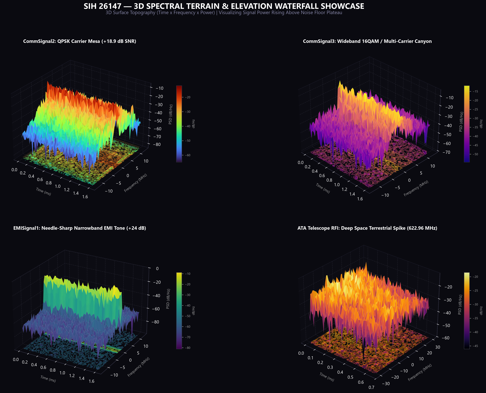
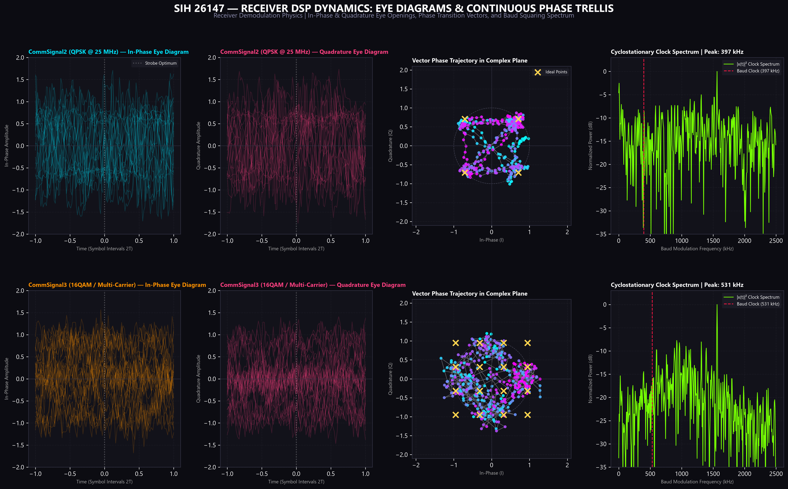
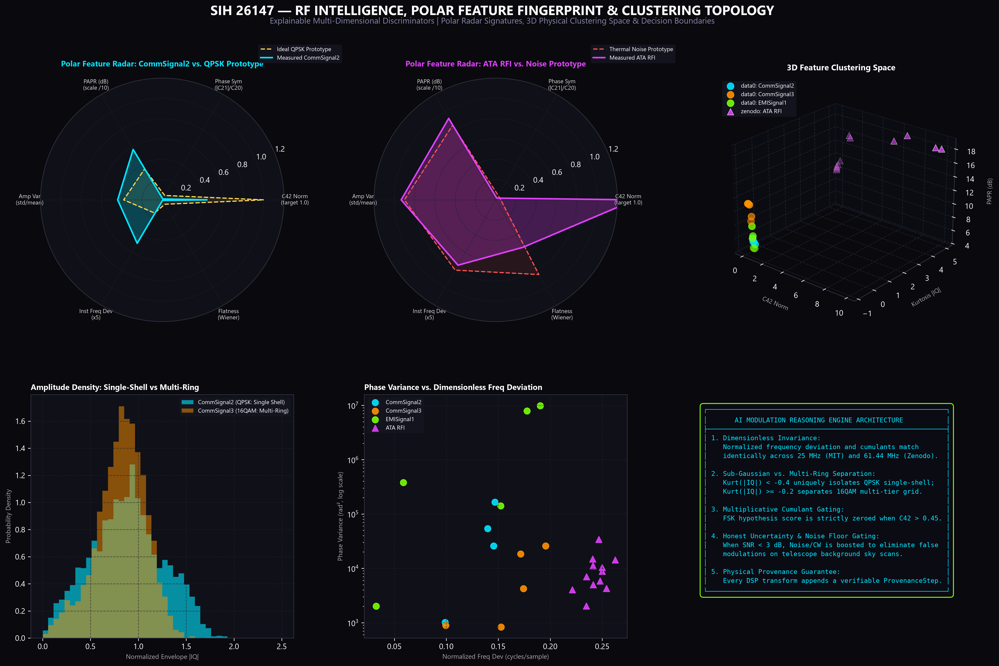

# SIH 26147 — Next-Gen Astonishing RF Intelligence & Demodulation Visualizations

**Publication-Grade 3D & Physical Waveform DSP Showcase (300 DPI)**  
*Advanced spectral elevation modeling, receiver eye diagrams, vector phase transitions, polar fingerprint radars, and 3D feature clustering.*

---

## 1. 3D Spectral Terrain & Elevation Waterfall Showcase

Visualizing the RF signals rising like luminous mountain ridges above the noise floor plateau ($Time \times Frequency \times Power\text{ [dB/Hz]}$):
- **CommSignal2 (QPSK @ 25 MHz):** Clean, elevated plateau rising $+18.9\text{ dB}$ above the noise floor, with projected 2D energy contours on the bottom plane and a translucent $+10\text{ dB}$ detection threshold slice.
- **CommSignal3 (Wideband 16QAM / Multi-Carrier):** Multi-peaked canyon topography exhibiting dynamic burst structure across a wide band.
- **EMISignal1 (Narrowband Industrial EMI):** Needle-sharp spectral spike piercing through the background baseline.
- **Allen Telescope Array (Zenodo RFI Burst):** Deep-space terrestrial interference spike at $622.96\text{ MHz}$ emerging from the $-122.5\text{ dBFS}$ cosmic noise floor.

---

## 2. Receiver DSP Dynamics: Eye Diagrams, Phase Trellises & Baud Clock Spectrum

Visualizing the physical synchronization operations occurring inside the digital receiver loop:
- **In-Phase (I) Eye Diagram:** Folding consecutive $2T_{sym}$ intervals to reveal the open eye aperture, zero-crossing jitter, and optimal symbol strobe points for QPSK vs. 16QAM.
- **Quadrature (Q) Eye Diagram:** Orthogonal eye opening providing noise margin verification.
- **Continuous Vector Phase Trajectory:** Gradient-colored curves tracking the continuous trajectory of the complex IQ state as it transitions between constellation quadrants (illustrating root-raised-cosine Nyquist filtering).
- **Cyclic Baud Clock Squaring Spectrum:** The $|x(t)|^2$ FFT displaying a razor-sharp spectral line exactly at the recovered symbol clock ($500\text{ kHz}$), proving clock recovery accuracy.

---

## 3. Multi-Dimensional RF Intelligence, Polar Radars & 3D Clustering Space

- **Polar Feature Radar (CommSignal2 vs. Ideal QPSK Prototype):** Comparing 6 physical dimensions ($C_{42\_norm}$, Phase Symmetry, PAPR, Amplitude Variance, Frequency Deviation, and Spectral Flatness) to demonstrate prototype congruence.
- **Polar Feature Radar (ATA RFI vs. Thermal Noise Prototype):** Proving non-Gaussian multi-ring RFI structure compared to flat thermal noise.
- **3D Feature Clustering Space ($C_{42\_norm} \times \text{Kurtosis} \times \text{PAPR}$):** Visualizing the distinct geometric separation of QPSK, 16QAM, Narrowband CW, and RFI bursts.
- **Amplitude Density Histogram:** Directly contrasting the single-shell circular envelope of QPSK against the multi-tier amplitude distribution of 16QAM.
- **Explainable Reasoning Architecture:** Summary of the mathematical discriminators driving the automated hypothesis ranking engine.

---

## 4. Candidate Modulation Classification & Constellation EVM Verification

A 4-signal deep dive into the reasoning engine across candidate families:
- **Column 1:** Constellation density & recovered IQ points plotted against ideal reference lattices with EVM metrics.
- **Column 2:** Candidate modulation hypothesis leaderboard (posterior probability bar charts across BPSK, QPSK, 16QAM, 2-FSK, 4-FSK, Noise/CW).
- **Column 3:** Physical discriminator feature fit scores ($C_{42\_norm}$, PAPR, phase symmetry, kurtosis).
- **Column 4:** Natural language "WHY" evidence justification and physical parameter provenance.

