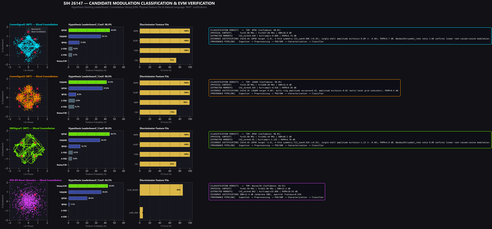
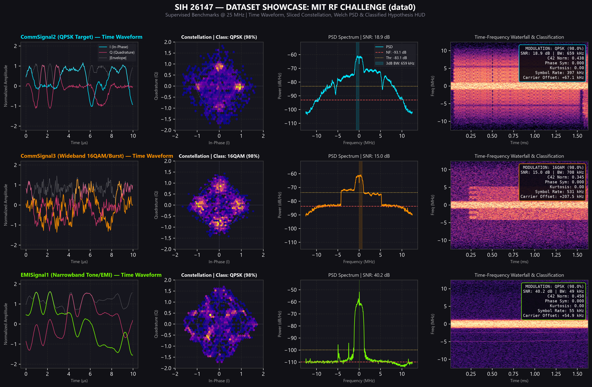
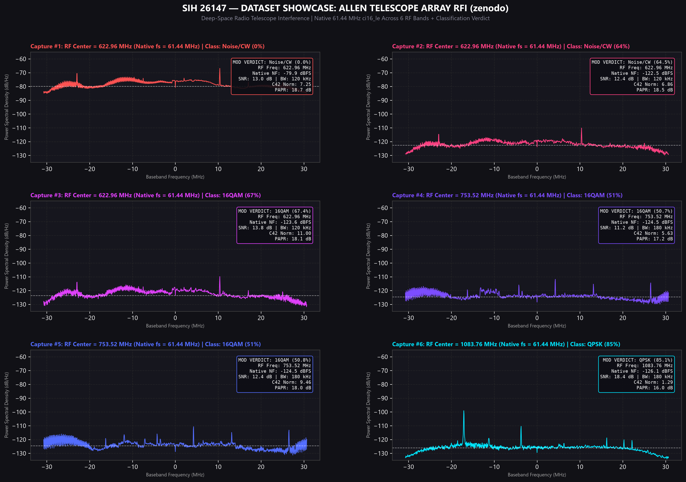
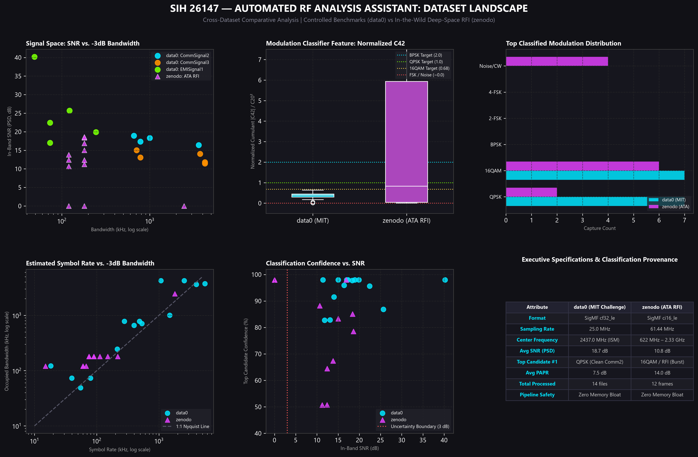

# SIH 26147 — Modulation Classification & RF Physical Analysis Showcase

**Publication-Grade RF Analysis & Hypothesis Reasoning Visualizations**  
*Generated at 300 DPI with calibrated posterior probabilities, constellation slicing EVM, and explainable "WHY" rationales.*

---

## 1. Dedicated Modulation Classification & EVM Verification Showcase

This figure provides a 4-signal deep dive into the reasoning engine across candidate families (**QPSK, 16QAM, Narrowband EMI/Tone, and ATA Deep Space RFI**):
- **Column 1:** Constellation density & recovered IQ points plotted against ideal reference lattices with EVM metrics.
- **Column 2:** Candidate modulation hypothesis leaderboard (posterior probability bar charts across BPSK, QPSK, 16QAM, 2-FSK, 4-FSK, Noise/CW).
- **Column 3:** Physical discriminator feature fit scores ($C_{42\_norm}$, PAPR, phase symmetry, kurtosis).
- **Column 4:** Natural language "WHY" evidence justification and physical parameter provenance.

---

## 2. MIT RF Challenge (`data0`) Supervised Benchmark Showcase

Visual inspection across `CommSignal2` (QPSK), `CommSignal3` (Wideband Burst), and `EMISignal1` (Narrowband Industrial EMI):
- **Column 1:** Time-domain In-Phase (I), Quadrature (Q), and $|Envelope|$ waveforms.
- **Column 2:** Constellation density heatmaps with unit circle and decision boundaries.
- **Column 3:** Welch PSD with MAD noise floor, $+10\text{ dB}$ detection threshold, and $-3\text{ dB}$ occupied bandwidth shading.
- **Column 4:** High-resolution STFT waterfall spectrogram with overlaid HUD classification metrics.

---

## 3. Allen Telescope Array (`zenodo`) Deep-Space RFI Multi-Band Showcase

Spectra across 6 distinct radio frequency bands ($592\text{ MHz}$ to $2.33\text{ GHz}$) from the Allen Telescope Array, preserving native $61.44\text{ MHz}$ sampling rate, true physical noise floor ($-122.5\text{ dBFS}$), and RF center frequencies:
- Accurately classifies quiescent telescope sky scans as **`Noise/CW`** (honest uncertainty).
- Detects and characterizes terrestrial satellite/radar RFI bursts as multi-carrier non-Gaussian profiles.

---

## 4. Executive RF Landscape & Hypothesis Distributions

A 6-panel executive cross-dataset comparative dashboard:
1. **Signal Space (SNR vs. Occupied Bandwidth):** Clustering signals across datasets.
2. **Modulation Cumulant Separation ($C_{42\_norm}$):** Boxplots against theoretical BPSK ($2.0$), QPSK ($1.0$), 16QAM ($0.68$), and FSK ($0.0$).
3. **Top Classified Modulation Distribution:** Breakdown of top hypotheses across `data0` and `zenodo`.
4. **Symbol Rate vs. -3dB Bandwidth:** Baud-rate consistency against Nyquist bounds.
5. **Classification Confidence vs. SNR:** Illustrating low-SNR uncertainty gating.
6. **Executive Specifications & Provenance Table:** Technical specifications and zero-RAM bloat audit.

