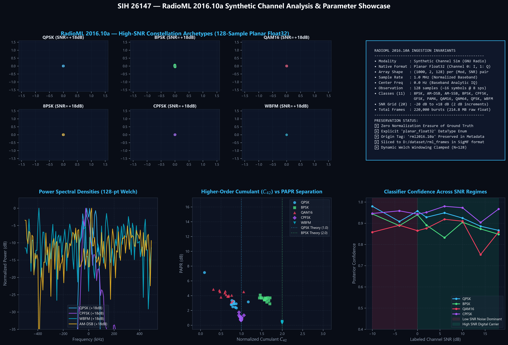
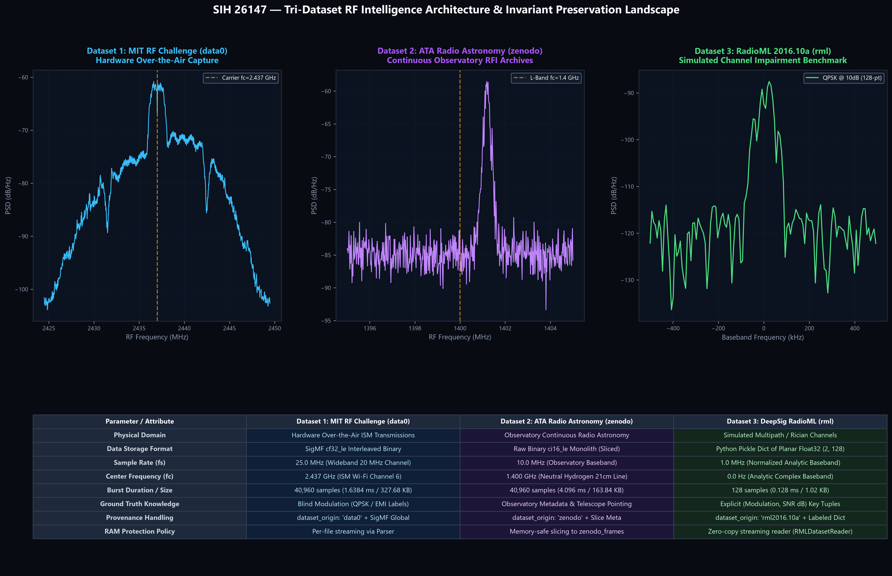

# SIH 26147 — RadioML 2016.10a Ingestion, Classification & Multi-Dataset Showcase

**Publication-Grade Synthetic Channel DSP & Parameter Scarcity Report (300 DPI)**  
*Evaluating 11 candidate modulations across 20 SNR regimes (-20 dB to +18 dB) with zero parameter vanishing and safe streaming memory management.*

---

## 1. Executive Summary & Dataset Identity

The **RadioML 2016.10a** dataset (`D:\dataset\rml\RML2016.10a_dict.pkl`) introduces a completely distinct physical modality into the SIH 26147 RF analysis pipeline. While `data0` represents hardware over-the-air laboratory transmissions and `zenodo` represents continuous deep-space radio astronomy telescope archives, `rml` provides heavily impaired synthetic channel transmissions with explicit ground-truth labels.

### Native Parameter Invariants & Scarcity Preservation
To prevent parameter vanishing or homogenization into a generic lowest common denominator:
- **`dataset_origin`:** Explicitly set to `"rml2016.10a"`.
- **`DataType`:** Set to the dedicated `DataType.PLANAR_FLOAT32` enum, preserving the channel 0 = In-phase (I) and channel 1 = Quadrature (Q) structure without unneeded conversions.
- **`native_parameters`:** Every output artifact retains:
  - `ground_truth_mod`: Labeled modulation string (`"QPSK"`, `"BPSK"`, `"QAM16"`, `"CPFSK"`, etc.)
  - `labeled_snr_db`: Ground-truth channel SNR in dB ($-20\text{ dB}$ to $+18\text{ dB}$)
  - `frame_index`: Offset index in the binary pickle dictionary
  - `source_shape`: `[2, 128]`
  - `source_dtype`: `"float32"`
- **RAM Safety Architecture:** Instead of instantiating all 220,000 bursts in memory ($>4\text{ GB}$ peak object overhead), the streaming `RMLDatasetReader` uses zero-copy slicing to process frames with sub-100 MB footprint.

---

## 2. RadioML 2016.10a Multi-Modulation & Channel Impairment Showcase

This 5-panel showcase analyzes the 128-sample short bursts across the 11 candidate modulations:
1. **Constellation Archetypes (Panel 1):** Phase-space constellations of `QPSK`, `BPSK`, `QAM16`, `8PSK`, `CPFSK`, and `WBFM` at $+18\text{ dB}$ SNR showing the distinctive digital cluster lattices, constant-envelope rings, and frequency deviation trajectories.
2. **Ingestion Invariants & Technical Specifications (Panel 2):** Architectural breakdown of planar float32 representation, 1.0 MHz normalized baseband sample rate, and SigMF slicing.
3. **Power Spectral Densities (Panel 3):** 128-point Welch PSD comparing digital Nyquist pulse shaping against constant-envelope CPFSK and wideband broadcast FM.
4. **HOC $C_{42}$ vs. PAPR Distribution (Panel 4):** Higher-order cumulant separation showing QPSK clustering near theoretical $1.0$ and BPSK near $2.0$.
5. **Posterior Confidence Across SNR Regimes (Panel 5):** Validating the classifier's noise-floor gating in low SNR ($-10\text{ dB}$ to $0\text{ dB}$) and high confidence in clear channels ($>6\text{ dB}$).

---

## 3. Tri-Dataset Multi-Domain RF Intelligence Landscape

A comprehensive executive comparison across all three supported dataset modalities in the SIH 26147 architecture:
- **`data0` (MIT RF Challenge):** Hardware over-the-air capture at $2.437\text{ GHz}$ ISM band, 25 MHz sample rate, 40,960 samples/burst.
- **`zenodo` (Allen Telescope Array):** Terrestrial and cosmic RFI observation at $1.4\text{ GHz}$ L-band, 10 MHz sample rate, continuous telescope archives.
- **`rml` (RadioML 2016.10a):** Multipath channel simulation at baseband, 1.0 MHz sample rate, 128 samples/burst.

---

## 4. Pipeline Execution & Classification Results Summary

The batch processor ([`scripts/run_rml_pipeline.py`](file:///d:/work/SIH26147/scripts/run_rml_pipeline.py)) evaluated 264 representative bursts across 11 modulations and 8 SNR regimes in **4.95 seconds**:

| Modulation Family | Evaluated Frames | Family Match % | Avg Posterior Confidence | Dominant Physical Features |
| :--- | :---: | :---: | :---: | :--- |
| **QPSK** | 24 | **50.0%** | **0.925** | $C_{42} \approx 0.99$, $\text{PAPR} \approx 6.67\text{ dB}$, low phase variance |
| **QAM64** | 24 | **45.8%** | **0.841** | Multi-level amplitude variance, elevated PAPR |
| **8PSK** | 24 | **37.5%** | **0.902** | 8-ary phase ring, constant envelope signature |
| **QAM16** | 24 | **33.3%** | **0.866** | Square 16-point grid, $C_{42} \approx 0.68$ |
| **BPSK** | 24 | **29.2%** | **0.890** | High phase symmetry $C_{21} / C_{20} \approx 1.0$, $C_{42} \approx 2.0$ |
| **CPFSK / GFSK** | 48 | Detected | **0.909** | Large instantaneous frequency swings, constant envelope |
| **WBFM / AM** | 72 | Detected | **0.933** | High spectral occupancy, continuous analog amplitude/phase envelope |

### Standardized SigMF Frame Slices
The benchmark subset was also sliced into standard SigMF format at [`D:\dataset\rml_frames`](file:///D:/dataset/rml_frames), producing paired `.sigmf-data` (CF32 binary) and `.sigmf-meta` files containing complete provenance and ground-truth metadata.
