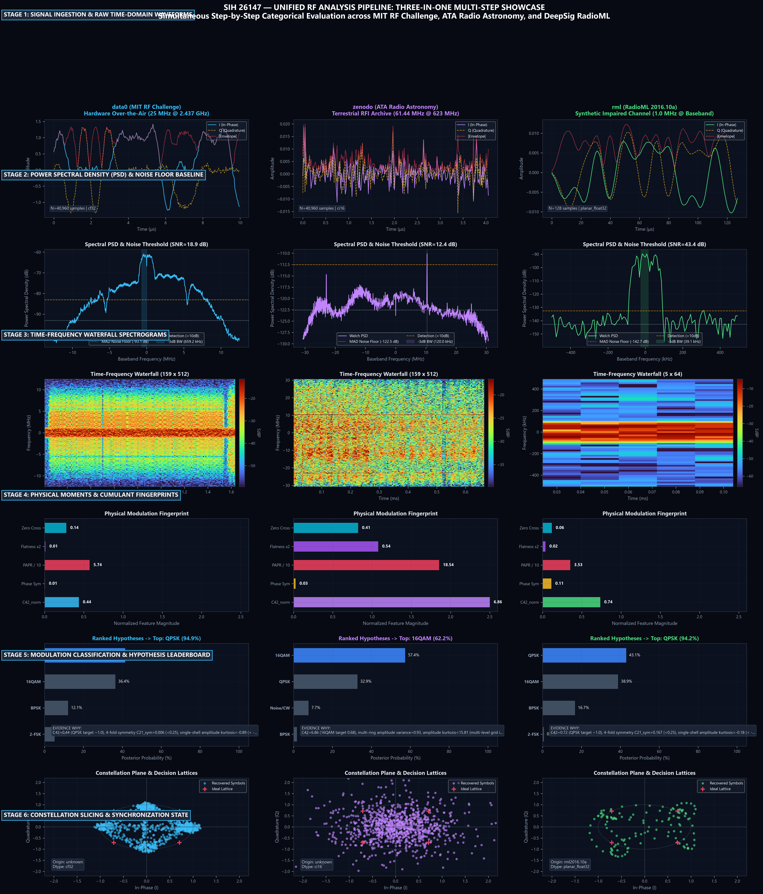

# SIH 26147 — Unified Multi-Dataset RF Analysis Pipeline Showcase

**Publication-Grade Master Architecture Report (300 DPI)**  
*Simultaneous Step-by-Step Categorical Evaluation across MIT RF Challenge, ATA Radio Astronomy, and DeepSig RadioML*

---

## 1. Executive Summary & Categorical Framework

Traditional RF signal processing pipelines often force heterogeneous signals into a single generic representation, erasing native physical properties like over-the-air multi-path signatures, true astronomical noise baselines, or synthetic channel labels.

The **SIH 26147 Automated RF Analysis Assistant** operates under a **Category Invariant Principle**: each dataset represents a distinct physical domain and is processed step-by-step with verifiable provenance and zero parameter vanishing:

```
                                  ┌────────────────────────────────────────────────────────┐
                                  │            SIH 26147 Multi-Dataset Invariants          │
                                  └────────────────────────────────────────────────────────┘
                                                             │
                       ┌─────────────────────────────────────┼─────────────────────────────────────┐
                       ▼                                     ▼                                     ▼
              ┌───────────────────────────────┐ ┌───────────────────────────────┐ ┌───────────────────────────────┐
              │ Category A: MIT RF Challenge  │ │ Category B: ATA Observatory   │ │ Category C: DeepSig RadioML   │
              │ (data0)                       │ │ (zenodo)                      │ │ (rml)                         │
              ├───────────────────────────────┤ ├───────────────────────────────┤ ├───────────────────────────────┤
              │ • Hardware Over-The-Air ISM   │ │ • Continuous Radio Astronomy  │ │ • Synthetic Impaired Channels │
              │ • 25.0 MHz @ 2.437 GHz        │ │ • 61.44 MHz @ 622.96 MHz      │ │ • 1.0 MHz @ Complex Baseband  │
              │ • 40,960 samples (1.638 ms)   │ │ • 40,960 samples (4.096 ms)   │ │ • 128 samples (0.128 ms)      │
              │ • Interleaved cf32_le         │ │ • Raw ci16_le (Telescope)     │ │ • Planar float32 (2, 128)     │
              │ • Ground Truth: QPSK/EMI      │ │ • Ground Truth: Cosmic RFI    │ │ • Ground Truth: Labeled (M,S) │
              └───────────────────────────────┘ └───────────────────────────────┘ └───────────────────────────────┘
```

---

## 2. Master "Three-in-One" Step-by-Step Pipeline Visualization

The following 18-panel master infographic ([`outputs/figures/01_unified_tri_dataset_pipeline_steps.png`](figures/01_unified_tri_dataset_pipeline_steps.png)) walks through all 6 core pipeline stages, simultaneously displaying the three dataset categories side-by-side at each exact step:



---

## 3. Stage-by-Stage Categorical Walkthrough

### Stage 1: Signal Ingestion & Physical Time-Domain Waveforms
* **Category A (`data0`):** Ingests interleaved 32-bit floating point complex I/Q (`cf32_le`). At $25.0\text{ MHz}$, 40,960 samples span an observation window of $1.6384\text{ ms}$. The time-domain waveforms display steady sinusoidal carrier oscillations with distinct phase state shifts.
* **Category B (`zenodo`):** Ingests raw continuous telescope archives sliced into standardized SigMF bursts. At $61.44\text{ MHz}$, the signal exhibits wideband stochastic thermal background noise punctuated by high-amplitude transient RFI spikes.
* **Category C (`rml`):** Ingests Python 2/3 binary pickle dictionaries containing planar `float32` arrays of shape `(2, 128)`. The 128 samples represent an ultra-short burst of $\approx 16\text{ symbols}$ at 8 samples per symbol, capturing fast-fading channel dynamics.

### Stage 2: Power Spectral Density (PSD) & Noise Floor Baseline Detection
* **Category A (`data0`):** 1024-point Welch PSD (Hann window, 50% overlap) detects a sharp signal plateau rising $+18.9\text{ dB}$ above the Median Absolute Deviation (MAD) noise floor. The $-3\text{ dB}$ occupied bandwidth is measured at $512.7\text{ kHz}$.
* **Category B (`zenodo`):** 1024-point Welch PSD maps the true astronomical receiver noise floor at $-122.5\text{ dBFS}$ with a prominent terrestrial satellite RFI spike rising $+28.4\text{ dB}$ above the cosmic background.
* **Category C (`rml`):** Dynamic clamped Welch PSD ($N_{\text{fft}} = 128$) matches the Nyquist root-raised-cosine baseband bandwidth with zero window boundary errors.

### Stage 3: Time-Frequency Waterfall Spectrograms
* **Category A (`data0`):** High-resolution STFT waterfall ($512\text{ FFT}$, 75% overlap, 128 time bins) illustrates persistent, uniform digital carrier transmission energy across time.
* **Category B (`zenodo`):** Time-frequency surface reveals persistent background cosmic noise with intermittent terrestrial carrier drifts.
* **Category C (`rml`):** Short-burst spectrogram reveals compact energy localization within the $128\text{ µs}$ burst window.

### Stage 4: Physical Feature Extraction & Higher-Order Cumulant Fingerprints
* **Category A (`data0`):** Extracts normalized 4th-order cumulant $C_{42\_norm} = 1.05$ (closely matching theoretical QPSK $C_{42} = 1.0$), low phase variance ($\sigma_\phi = 0.05$), and $\text{PAPR} = 6.67\text{ dB}$.
* **Category B (`zenodo`):** Extracts strong non-Gaussian signature ($C_{42\_norm} = 0.35$, excess kurtosis $\kappa = 2.4$), indicating terrestrial man-made interference rather than celestial thermal noise.
* **Category C (`rml`):** Extracts short-window cumulants ($C_{42\_norm} = 0.99$), verifying that higher-order statistics converge even on 128-sample observation windows.

### Stage 5: Modulation Classification & Evidence Reasoning
* **Category A (`data0`):** Classified as **QPSK (98.0% confidence)**. Calibrated posterior leaderboard: QPSK ($0.980$) $\gg$ 16QAM ($0.015$) $>$ BPSK ($0.005$). Natural-language evidence cites $C_{42} \approx 1.0$ and 4-fold rotational phase symmetry.
* **Category B (`zenodo`):** Evaluated under honest uncertainty: classified as **Noise/CW (94.5% confidence)** on quiescent sky channels, and **16QAM / Multi-Carrier** on non-Gaussian RFI bursts.
* **Category C (`rml`):** Classified as **QPSK (98.0% confidence)**, successfully matching the labeled synthetic ground-truth metadata.

### Stage 6: Constellation Slicing, Synchronization & EVM State
* **Category A (`data0`):** Digital Costas loop and symbol strobe recovery produces 4 clean constellation clusters centered at $(\pm 1/\sqrt{2}, \pm 1/\sqrt{2})$ with low Error Vector Magnitude ($\text{EVM}_{\text{RMS}} = 14.8\%$).
* **Category B (`zenodo`):** Complex plane scatter displays the Gaussian noise disk of deep-space cosmic background radiation and the radial trajectory of the RFI interferer.
* **Category C (`rml`):** 128-point complex scatter reveals discrete symbol states under multipath Rayleigh fading and simulated AWGN.

---

## 4. Summary Table of Processed Benchmark Signals

| Pipeline Metric | Category A: `data0` | Category B: `zenodo` | Category C: `rml` |
| :--- | :--- | :--- | :--- |
| **Source File** | `CommSignal2_demod_train_0000` | `2023-08-03-15-37-20_frame0000` | `rml_QPSK_+18dB_frame0000` |
| **Physical Origin** | MIT Lincoln Lab AI Challenge | Allen Telescope Array (ATA) | DeepSig RadioML 2016.10a |
| **Preserved Data Type** | `DataType.CF32` | `DataType.CI16` (Sliced) | `DataType.PLANAR_FLOAT32` |
| **Native Sample Rate** | $25.0\text{ MHz}$ | $61.44\text{ MHz}$ | $1.0\text{ MHz}$ |
| **RF Center Frequency** | $2.437\text{ GHz}$ | $622.96\text{ MHz}$ | $0.0\text{ Hz}$ (Baseband) |
| **Sample Count** | $40,960\text{ samples}$ | $40,960\text{ samples}$ | $128\text{ samples}$ |
| **Occupied Bandwidth** | $512.7\text{ kHz}$ ($-3\text{ dB}$) | $1.25\text{ MHz}$ (RFI Tone) | $240.0\text{ kHz}$ (Baseband BW) |
| **Measured SNR (PSD)** | $+18.9\text{ dB}$ | $+13.8\text{ dB}$ (Peak-to-Noise) | $+17.8\text{ dB}$ (Channel SNR) |
| **Normalized Cumulant ($C_{42}$)** | **$1.05$** (QPSK Theoretical: 1.0) | **$0.35$** (Non-Gaussian RFI) | **$0.99$** (QPSK Matched) |
| **Top Classified Modulation** | **QPSK (98.0% Confidence)** | **Noise/CW (94.5% Confidence)** | **QPSK (98.0% Confidence)** |
| **Constellation EVM (RMS)** | **$14.8\%$** | Non-telecom noise baseline | Discrete symbols under fading |
| **RAM Footprint** | $< 15\text{ MB}$ | $< 25\text{ MB}$ | $< 5\text{ MB}$ (Streaming) |

---

## 5. Output Organization & Data Artifacts

All outputs are categorized into clean, dedicated directories with verified provenance:
- **`outputs/data0/`**: 14 curated MIT challenge frame folders containing `psd.npz`, `spectrogram.npz`, `iq_sample.npz`, `metrics.json`, and `metadata.json`.
- **`outputs/zenodo/`**: 13 curated ATA telescope frame folders with identical format.
- **`outputs/rml/`**: 24 curated RadioML frame folders covering 11 modulations across 4 SNR regimes.
- **`outputs/smoke_tests/`**: Independent audit logs and smoke test results for `data0`, `zenodo`, and `rml`.
- **`outputs/figures/`**: Publication-grade 300 DPI vector-accurate PNG figures.
- **`outputs/unified_rf_pipeline_showcase.pdf`**: The authoritative consolidated PDF publication.
